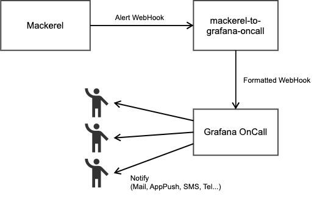

# mackerel-to-grafana-oncall

A proxy of Mackerel alert webhook to [Grafana OnCall](https://grafana.com/products/oncall/) Webhook.

## Usage

```console
Usage of ./mackerel-to-grafana-oncall:
  -allow-oncall-url-param
        allow Grafana oncall by url param
  -critical-only
        send critical only (ignore warning and unknown)
  -debug
        debug mode
  -grafana-oncall-url string
        Grafana oncall webhook url
  -grafana-oncall-url-aliases string
        Grafana oncall webhook url aliases(string of JSON object)
  -port int
        port number (default 8000)
  -version
        show version
```

Environment variables also can set these flags. `GRAFANA_ONCALL_URL`, `ALLOW_ON_CALL_URL_PARAM`, `PORT` and etc.

This server endpoint works as Mackerel alerting Webhook URL.

## Description

This server accepts [Mackerel Webhook](https://mackerel.io/ja/docs/entry/howto/alerts/webhook) events and deleagates to [Grafana OnCall](https://grafana.com/products/oncall/).

This application binary can run as a standalone http server and also run as an AWS Lambda function bootstrap invoked by function URL or API Gateway.



## Configurations

### `-allow-oncall-url-param` and `-grafana-oncall-url`

When `-allow-oncall-url-param` is true, a server accepts URL parameter `oncall_url` in query strings. The server will send a webhook to the URL specified by `oncall_url`.

Otherwise(by default), the server will send a webhook to the URL defined by `-grafana-oncall-url`.

### `-grafana-oncall-url-aliases`

This flag defines aliases for `oncall_url` by JSON string.

If the JSON strings are provided as below, `oncall_url` URL parameter accepts `foo` and `bar`, and the webhook will be sent to the defined URL by JSON.
```json
{
  "foo": "https://oncall-prod-us-central-0.grafana.net/oncall/integrations/v1/formatted_webhook/xxxxxxx/",
  "bar": "https://oncall-prod-us-central-0.grafana.net/oncall/integrations/v1/formatted_webhook/yyyyyy/"
}
```

## LISENCE

MIT
